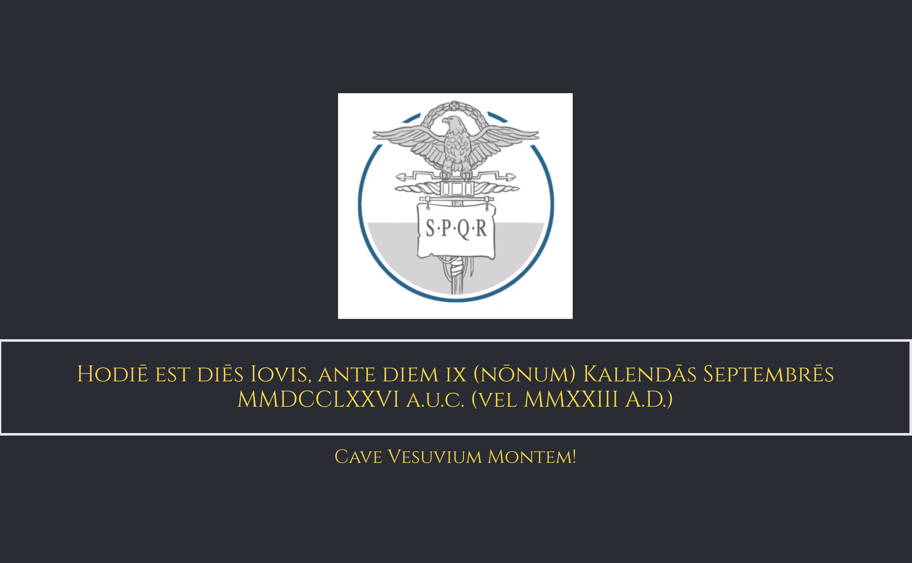

## Table of Contents

- [Intro](#intro)
- [Usage](#usage)
  - [Setup](#setup) 
- [Credit](#credit)
- [Contributing](#contributing)

## Intro 

This Chrome extension replaces your new tab with the image seen above. There's no better way to familiarize yourself with Latin ordinal numbers, days of the week, and monthly dates than to see them every day!

Features:
- Roman year (ab urbe condita)
- Christian year
- Day of the week
- Select holidays
- Ordinal numbering
- Mācrōns everywhere (!)
- and of course the Latin monthly dating system

As a dev bonus, this repo now contains the most well-tested Latin date conversion utilities of any library anywhere - and in TypeScript, for maximum accessibility. You can read through it just to familiarize yourself with the Latin system. If there is interest I will break it out into a separate library.

### Basics of Dates

> Dates on the ides, nones and kalends are given in the ablative. Dates with ante are given in the accusative, so ante diem undecimum kalendas ianuarias. It's in the accusative because it expresses not the idea of being 'on' a certain day (like the ablative), but how long before the kalends it is.
> This system uses inclusive counting, so ad xi kal ian is 22nd Dec.

> Dates one day before a key date are given with pridie and the accusative, e.g. pridie kalendas ianuarias.

Those rules taken verbatim from a post somewhere.
## Usage 

At the moment, this extension is not in the Chrome store. To use it, you'll have to follow the instructions below, but then you'll have it even when you are not running `yarn dev`!

### Setup 
1. Clone this repository.
2. Run `yarn && yarn dev` in a terminal after navigating to the directory
3. Load Extension on Chrome
   1. Open - Chrome browser
   2. Access - chrome://extensions
   3. Check - Developer mode
   4. Find - Load unpacked extension
   5. Select - `dist` folder in this project (after dev or build)
4. On a different page (not in extensions), hit Command-Shift-Y. The popup will open!
5. If you want to build in production, Just run `yarn build` or `npm run build`.

# Credit 
- I relied heavily on ChatGPT to help me translate @nivek1985's [sterling bash script](https://github.com/nivek1385/latindate) into TS. I have used his work for several years - all credit to him for everything in this repo! tibi grātiās agō et agimus!

- [This website](https://www.dcode.fr/latin-date) helped me make test cases.

- [Luke's posts here](https://www.textkit.com/greek-latin-forum/viewtopic.php?t=4386) helped me find an off-by-one error.

- Many thanks for [extension boilerplate](https://github.com/JohnBra/vite-web-extension)

# Contributing 
Feel free to open PRs or raise issues!
